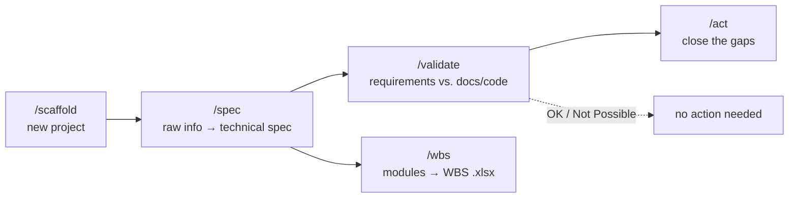

# ai-cook-town

**A [Claude Code](https://code.claude.com) plugin that works like a full-stack software engineer for your project** — scaffold new work, turn ideas into specs, validate requirements against reality, and act on the gaps.

```
/plugin marketplace add HarrySmith852/ai-cook-town
/plugin install ai-cook-town
```

---

## Contents

- [Why](#why)
- [The pipeline](#the-pipeline)
- [Commands](#commands)
- [Installation](#installation)
- [Usage](#usage)
- [Bundled skills](#bundled-skills)
- [Hooks](#hooks)
- [Project structure](#project-structure)
- [Development](#development)

## Why

Most AI coding tools jump straight to writing code. ai-cook-town adds the steps a careful engineer takes around that: scaffold with the right conventions, turn vague asks into a real spec, check whether a requirement is actually satisfiable before promising it, and only then act — using existing, vetted skills where one already does the job instead of reinventing it.

## The pipeline



Each stage is optional on its own — start wherever fits (e.g. run `/validate` alone against an existing codebase).

## Commands

| Command | Delegates to | Does |
|---|---|---|
| `/scaffold` | `project-scaffolder` | Starts a new project or package: clarifies the stack, lays down conventional structure, wires up baseline tooling (deps, lint/test config, `.gitignore`, README, optional git init). |
| `/spec` | `spec-writer` | Turns raw input (notes, a conversation, a partial doc, existing code) into a structured full-stack spec — frontend, backend, data model, API, open questions. |
| `/validate` | `requirement-validator` | Checks requirement(s) against the project's actual docs/code. Verdict per requirement: **OK**, **Not OK**, **Possible**, **Not Possible** — each with cited evidence. |
| `/act` | `action-executor` | Takes a `/validate` report, finds relevant skills for each actionable finding via `find-skills`, installs what fits, and performs the resulting changes. |
| `/wbs` | `wbs-generator` | Generates a Work Breakdown Structure `.xlsx` for the project — modules → sub-modules → tasks, with Dependencies/Status/ETA columns, color-coded by status. |

Every command runs its own subagent in an isolated context — the main conversation doesn't get cluttered with the work.

## Installation

```
/plugin marketplace add HarrySmith852/ai-cook-town
/plugin install ai-cook-town
```

For local development, point `marketplace add` at your local checkout path instead of a GitHub repo.

## Usage

```
/scaffold A Node/Express API with Postgres
/spec Users should be able to reset their password via email
/validate The API must support pagination on the /orders endpoint
/act <paste the validation report from /validate>
/wbs Based on the last /spec
```

**Example `/validate` output shape:**

```
Summary: 2 OK · 1 Not OK · 3 Possible · 1 Not Possible

- Password reset via email           OK          — see auth/reset.ts:14
- Pagination on /orders               Not OK      — endpoint returns full table, no `page`/`limit` params
- Rate limiting on /orders             Possible    — no blocker, not yet implemented
- Real-time order updates              Not Possible — no websocket layer; would require new infra
...
```

## Bundled skills

`plugin.json`'s `skills` field points at `.agents/skills`, so all of the following install automatically with the plugin — nothing extra to run.

| Skill | Source | Used for |
|---|---|---|
| `find-skills` | [vercel-labs/skills](https://github.com/vercel-labs/skills) | Discovering and installing other skills on demand (used by `action-executor`) |
| `brainstorming` | [obra/superpowers](https://github.com/obra/superpowers) | Framing open-ended requests before `/scaffold` or `/spec` |
| `writing-plans`, `executing-plans` | obra/superpowers | Turning a spec into a stepwise implementation plan and running it |
| `systematic-debugging` | obra/superpowers | Root-causing bugs and unexpected behavior methodically |
| `test-driven-development`, `verification-before-completion` | obra/superpowers | Writing tests first; not claiming "done" without proof |
| `subagent-driven-development`, `dispatching-parallel-agents` | obra/superpowers | Splitting independent work across subagents |
| `requesting-code-review`, `receiving-code-review` | obra/superpowers | Getting and acting on review feedback |
| `using-git-worktrees`, `finishing-a-development-branch` | obra/superpowers | Isolating feature work and closing it out cleanly |
| `writing-skills`, `using-superpowers` | obra/superpowers | Authoring new skills; knowing when to reach for one |

To add more: `npx skills add <repo> --skill <name>` from the project root — it installs into `.agents/skills`, updates `skills-lock.json`, and ships with the plugin on the next release.

## Hooks

On `SessionStart`, `hooks/check-eslint.js` checks whether the project has a `package.json` (i.e. is a Node project) without `eslint` as a dependency. If so, it surfaces that to Claude, which then **asks before** installing `eslint` as a dev dependency — never silently.

## WBS generation

`/wbs` produces a real `.xlsx` — not a markdown table — matching a standard WBS layout: **modules → sub-modules → tasks**, with Dependencies / Frontend Status / Backend Status / ETA columns, status cells color-coded (green = Complete, yellow = In Progress, orange = Not Started/Pending, red = Blocked). It's generated by `scripts/generate-wbs.js` using `xlsx-js-style`, installed in an isolated `scripts/node_modules` the first time it's needed — it never touches the target project's own `package.json` or dependencies.

## Project structure

```
.claude-plugin/
  plugin.json                  # plugin manifest
  marketplace.json              # makes this repo installable via /plugin marketplace add
commands/
  scaffold.md                   # /scaffold → project-scaffolder
  spec.md                       # /spec     → spec-writer
  validate.md                   # /validate → requirement-validator
  act.md                        # /act      → action-executor
  wbs.md                         # /wbs      → wbs-generator
agents/
  project-scaffolder.md         # new project structure + baseline tooling
  spec-writer.md                # raw input → full-stack spec
  requirement-validator.md      # requirements vs. docs/code, with verdicts
  action-executor.md            # closes gaps found by /validate, using relevant skills
  wbs-generator.md               # modules/tasks → WBS .xlsx
hooks/
  hooks.json                    # SessionStart hook wiring
  check-eslint.js                # flags missing eslint on Node projects
scripts/
  generate-wbs.js                # writes the WBS .xlsx (used by wbs-generator)
  package.json                   # generator's own isolated dependency (xlsx-js-style)
.agents/skills/                 # bundled skills — see table above
skills-lock.json                 # pins bundled skill sources/versions
```

## Development

Edit the files above directly, then reload the plugin in Claude Code to pick up changes.

- Commands are prompt templates in `commands/*.md` — front matter takes `description` and `argument-hint`; `$ARGUMENTS` is replaced with whatever follows the slash command.
- Agents are subagent definitions in `agents/*.md` — front matter takes `name`, `description` (used for auto-delegation matching), and `tools`.
- See the [Claude Code plugin docs](https://code.claude.com/docs/en/plugins) for the full manifest schema and hook event reference.
